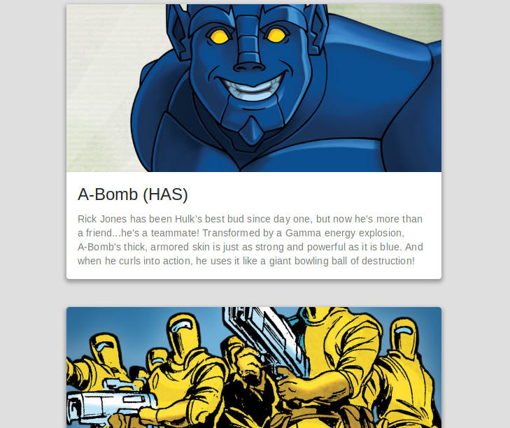

# Consuming an API of Marvel Studios

  ## Used
  
  - Redux
  - Redux-saga
  - ReactJS
  - React-native
  - Material-UI
  - React-native-elements
  
## Initing in the your PC

- For clone the project `git clone https://github.com/Wellers0n/Marvel.git`
- Enter in the folder `cd Marvel/`
- To install project dependency: `yarn install`
- After the installation of the dependencies `yarn start` in the default directory

## Routers in the web

  ### Default `/`

